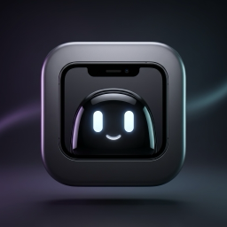

# Notchy

<p align="center">
  
</p>

<p align="center">
  <strong>A macOS menu-bar utility that lives behind the notch.</strong><br>
  Hover to reveal a beautiful panel of mini-modules — right where your screen already has dead space.
</p>

<p align="center">
  
  
  
</p>

---

## Features

| Module | What it does |
|---|---|
| 🎵 **Media Controls** | Now Playing info, play/pause/skip, scrubber, volume — powered by MediaRemote |
| 📋 **Clipboard History** | Persisted clipboard ring with search and one-tap paste |
| 📁 **File Shelf** | Temporary file drop-zone with AirDrop support |
| 📷 **Selfie Camera** | Quick front-camera preview without opening Photo Booth |
| ⏱ **Focus Timer** | Pomodoro-style countdown with presets |
| 🔐 **OTP Codes** | TOTP codes that auto-copy to clipboard |
| 🤖 **AI Token Monitor** | Tracks API usage across popular AI providers |
| 📊 **System Stats** | CPU, memory, network, battery at a glance |

**Plus:**
- Adaptive panel layout — modules reflow to 1, 2, or 3 columns based on page count
- Liquid Glass UI with concentric squircle cards
- Auto-update checker (hosted version manifest, no App Store required)
- Launch at Login via `SMAppService`
- Non-notch Mac support — renders as a floating Dynamic Island–style pill

---

## Requirements

- macOS 15.0 (Sequoia) or later
- MacBook with a notch (2021 MacBook Pro or newer) — also works on non-notch Macs as a floating pill

---

## Build & Run

```bash
# From repo root
cd Notchy
xcodebuild -scheme Notchy -configuration Debug build
open ~/Library/Developer/Xcode/DerivedData/Notchy-*/Build/Products/Debug/Notchy.app
```

Or open `Notchy.xcodeproj` in Xcode 16+ and press **⌘R**.

---

## Architecture

```
Notchy/
├── App/            Entry point (@main + MenuBarExtra), AppDelegate, Settings window
├── Notch/          NSPanel, NotchViewModel, shape definitions, hover logic (NSEvent monitors)
├── Modules/        One folder per module — Manager (logic) + View (SwiftUI)
└── Settings/       SettingsView (tabs: General, Live Activities, Pages & Layout, Appearance, File Shelf, AI Providers, Support, About)
```

**Key design decisions:**

- **Window** — fixed-frame borderless `NSPanel` at `level = .mainMenu + 3`. Only the SwiftUI reveal mask animates; the frame never moves (no animation glitches).
- **Hover detection** — global `NSEvent` mouse monitors (more reliable than `.onHover` at the screen edge). Closed panel sets `ignoresMouseEvents = true` so it never blocks the menu bar.
- **Media** — routes through the vendored `MediaRemoteAdapter.framework` (BSD-3 licensed, see `Vendor/`). Required because macOS 15.4+ blocks direct `MediaRemote` access for third-party apps.
- **Updates** — checks `https://www.nildesai.com/notchy/version.json` at launch. Downloads the DMG URL from the manifest if a newer version is available.

---

## Update System

Notchy uses a lightweight self-hosted update manifest. A `version.json` is hosted at:

```
https://www.nildesai.com/notchy/version.json
```

Example manifest:

```json
{
  "version": "1.0.0",
  "releaseDate": "2026-09-26",
  "releaseNotes": "Initial release.",
  "downloadUrl": "https://www.nildesai.com/notchy/Notchy-1.0.0.dmg",
  "minimumOsVersion": "15.0"
}
```

To ship an update: bump the version in `version.json`, upload the new `.dmg` alongside it, and users will be prompted on next launch.

---

## Vendor / Third-party

| Library | License | Purpose |
|---|---|---|
| [mediaremote-adapter](https://github.com/ungive/mediaremote-adapter) | BSD-3-Clause | Now Playing metadata on macOS 15.4+ |

See [`MEDIAREMOTE-ADAPTER-LICENSE`](Vendor/MEDIAREMOTE-ADAPTER-LICENSE) for the full text.

---

## License

MIT © 2026 Nilkanth Desai — see [LICENSE](LICENSE).
